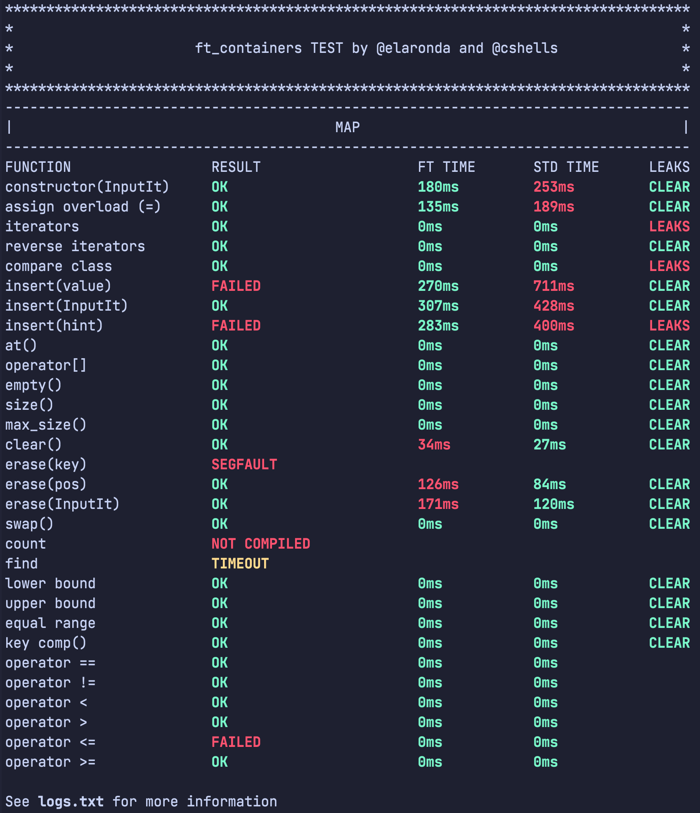

# ft_containers-unit-test


## About
<span>ft containers unit test</span> is a complete testing for project of school 21/ecole 42, allowing you test your containers: <b>Vector</b>, <b>Stack</b>, <b>Map</b>, <b>Set</b> and <b>Utilities</b> in <b>ft</b> namespace, track your progress and including benchmark for every method </br>
This test checks 90% of subject and checklist requires, but keep in mind that test doesn't check something you don't need to implement and was written by students, so im waiting for your bugs or suggestions for improving

# Getting started
## ⚙️ Installation
run this command <b>inside</b> your ft_containers folder:
```
git clone https://github.com/divinepet/ft_containers-unit-test
```
then
```
cd ft_containers_unit_test
```
now you need to configure file ```config.hpp``` and write correct names of all your files and classes, and the last step is
```
./start.sh
```
## ⚠️ config.hpp
if you haven't some class implementation yet, for example <b>Map</b>, you need to <b><i>comment</i></b> this line:
```
// #include "../Map.hpp"
```
and etc. for other
## 📄 start.sh
you can run tests with a specific container, use flags for this
```
./start.sh -v // for vector
./start.sh -u // for utilities
./start.sh -st // for stack
./start.sh -m // for map
./start.sh -s // for set
./start.sh -h // help with commands
```
# Results

 <b>NOT COMPILED</b> means that method compiles with errors, also probably some template name in ```config.hpp``` is incorrect</br>
 <b>TIMEOUT</b> means the method exceeded the maximal execution time, probably due to an infinite loop
#### Press Star ⭐ if this test helped you, so that more people can see it
